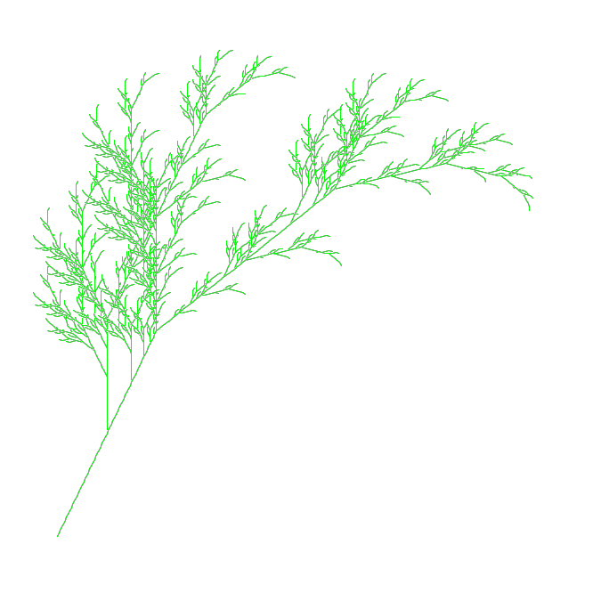

# NumPy Turtle

Draw directly onto a NumPy array using very easy turtle graphics.
Inspired by the [turtle](https://docs.python.org/3.6/library/turtle.html) library.

## Examples

<table>
<tr>
<td>

Koch curve ([code](numpy_turtle/examples/koch_curve_c.py)):


</td>
<td>

Sierpinski triangle ([code](numpy_turtle/examples/sierpinski_triangle.py)):


</td>
</tr>
<tr>
<td>

Fractal plant ([code](numpy_turtle/examples/fractal_plant.py)):



</td>
<td>

Fractal conifer ([code](numpy_turtle/examples/conifer.py)):


</td>
</tr>
</table>


## Installation

```bash
pip install numpy-turtle
```
